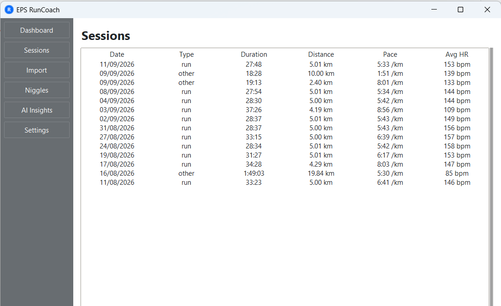
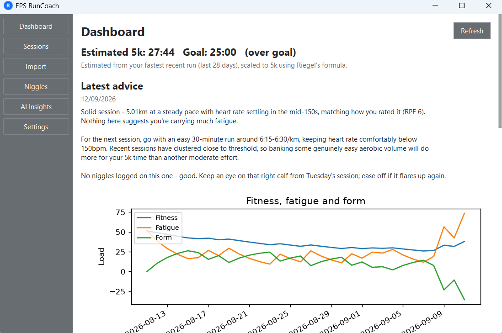
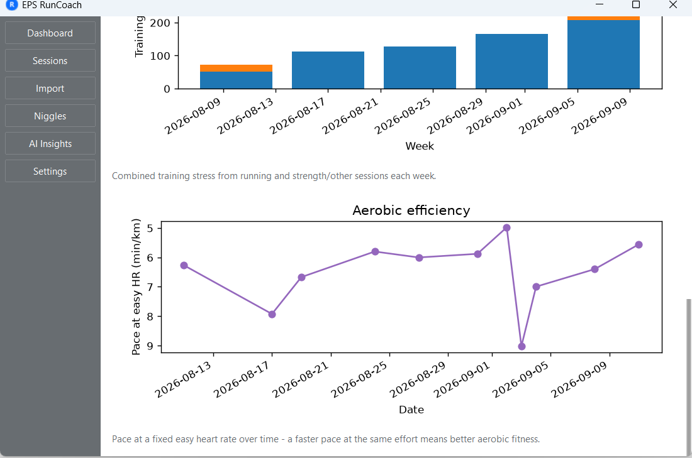
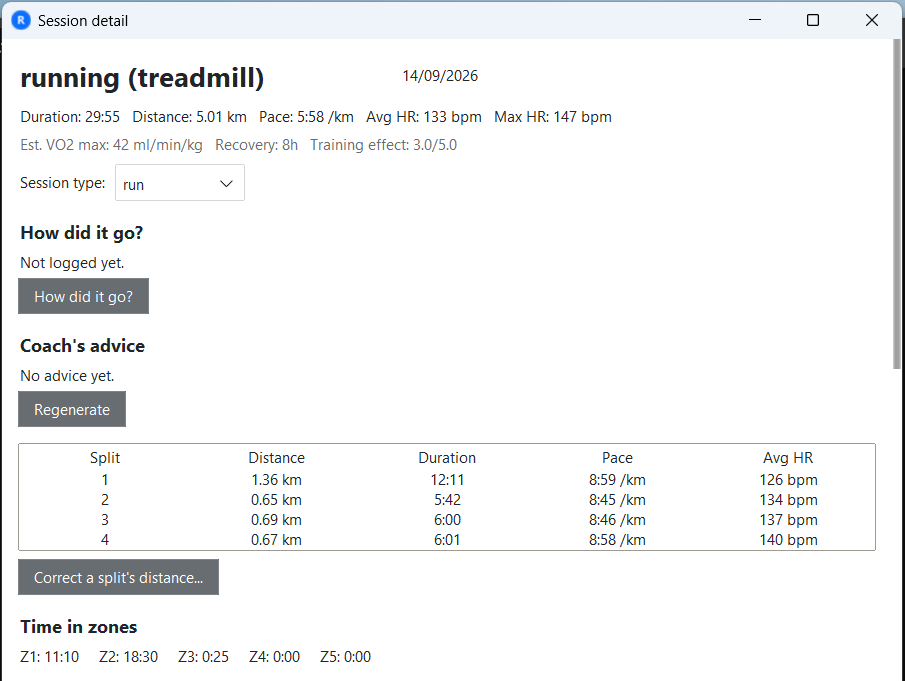
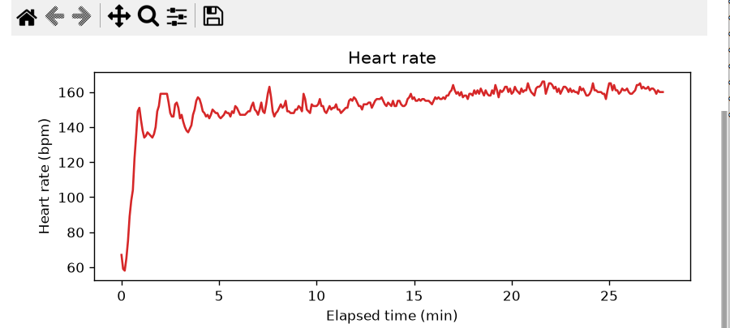
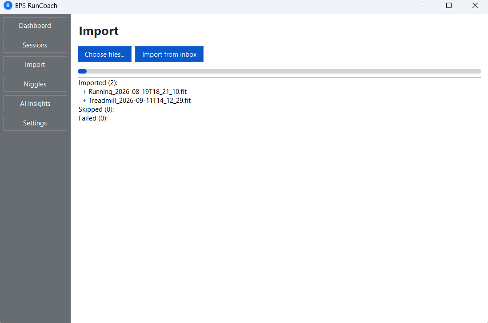
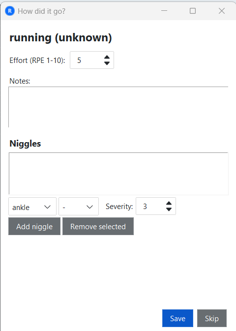
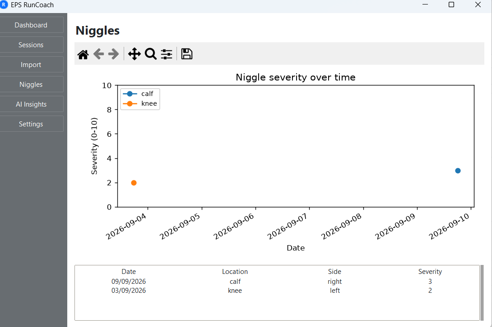
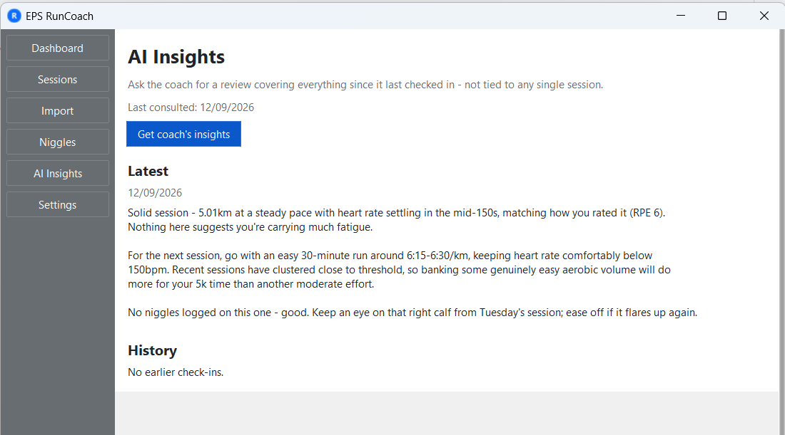
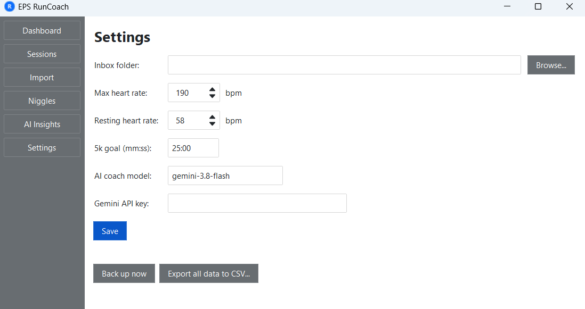

# EPS RunCoach

A private, single-user Windows desktop app for recreational runners. It imports your training sessions from a Suunto watch (FIT files), tracks runs and strength work, captures how each session felt, calculates training load and fitness metrics, and uses an AI coach to review your training and suggest what to do next.

Built for one person's own training data, on their own machine. Nothing is uploaded anywhere except the compact, anonymised summary sent to the AI coach — see [Privacy](#privacy) below.



## Features

- **Import** FIT files exported from a Suunto watch (or dropped into a watched inbox folder), with duplicate detection and automatic backups.
- **Sessions** table — sortable, at a glance: date, type, duration, distance, pace, heart rate.
- **Session detail** — splits, time-in-heart-rate-zones, pace and heart-rate charts, and your own notes.
- **How did it go?** — log effort (RPE), free-text notes, and niggles (with body location, side and severity) after any session.
- **Dashboard** — estimated 5k time vs your goal, fitness/fatigue/form trend, weekly distance and training load, and aerobic efficiency over time.
- **Niggles tracking** — severity-over-time chart per body location, so a nagging ache doesn't sneak up on you.
- **AI Insights** — ask an AI coach for a review of everything since it last checked in: what changed, what to do next, and a history of past check-ins. Manually invoked, not automatic — nothing gets sent anywhere without you asking for it.
- **Settings** — inbox folder, heart rate zones, 5k goal, AI coach model and API key, database backups, and a full CSV export of your data.

## Privacy

- GPS coordinates are **never stored** — they're discarded the moment a FIT file is read, even before the file is imported.
- Your training data lives in a local SQLite database on your own machine, never uploaded anywhere.
- When you ask the AI coach for a review, only a compact text summary is sent (stats, notes, RPE, niggles) — never raw files, GPS, or your name.
- The AI coach needs its own API key (see [Configuration](#configuration)), which is yours — nobody else sees your training data or your key.

## Screenshots

<details>
<summary>Dashboard</summary>




</details>

<details>
<summary>Session detail</summary>




</details>

<details>
<summary>Import and "How did it go?"</summary>




</details>

<details>
<summary>Niggles and AI Insights</summary>




</details>

<details>
<summary>Settings</summary>



</details>

## Getting started

### Option A: Install it (Windows)

1. Download the installer from the [latest release](https://github.com/escull/EPS_runcoach/releases/latest) — `EPS_RunCoach_Setup_vX.Y.Z.exe`.
2. Run it and follow the wizard. It adds a Start Menu entry, an optional desktop shortcut, and an uninstaller under "Add or Remove Programs".
3. Your data lives in `%APPDATA%\EPS RunCoach\` — separate from the install folder, and untouched by upgrading to a newer release.

### Option B: Run from source (any platform with Python)

Requires [uv](https://docs.astral.sh/uv/) and Python 3.14+ (the desktop UI needs Python's Tk support, which comes with the standard python.org installer on Windows).

```bash
git clone <this-repo>
cd EPS_runcoach
uv run python -m eps_runcoach
```

Your data lives in `data/` inside the project folder when run this way.

### Building the packaged app and installer yourself

```bash
uv run pyinstaller eps_runcoach.spec --noconfirm
```

Output goes to `dist/EPS_RunCoach/`. Safe to re-run any time — your data location doesn't change between rebuilds.

To turn that into an installer like the one on the Releases page, install [Inno Setup](https://jrsoftware.org/isinfo.php) and compile `eps_runcoach.iss`:

```bash
ISCC.exe eps_runcoach.iss
```

Output goes to `dist_installer/EPS_RunCoach_Setup_vX.Y.Z.exe`.

## Configuration

Open the **Settings** page (see screenshot above) and fill in:

- **Inbox folder** — where you drop FIT files exported from your watch, for the "Import from inbox" button.
- **Max / resting heart rate** — used for training load, heart-rate zones, and the aerobic efficiency chart. Max heart rate is pre-filled with a suggestion based on the highest heart rate seen in your imported sessions.
- **5k goal** — as `mm:ss`, defaults to 25:00.
- **AI coach model / API key** — to use the AI coach, get a free Gemini API key from [Google AI Studio](https://aistudio.google.com/apikey) and paste it in here. Without a key, everything else works fine — you'll just see a friendly message instead of AI advice.

## Development

```bash
uv run pytest          # run the test suite
uv run python -m eps_runcoach   # launch the app
```

See `CLAUDE.md` for the full architecture, coding conventions, and build-phase history of this project.

## Platform support

Currently **Windows only**. The core logic and UI (tkinter/ttkbootstrap/matplotlib) are cross-platform, but the packaged build, data location (`%APPDATA%`), and app icon are Windows-specific right now. A macOS build would need to be produced on a Mac (PyInstaller doesn't cross-compile) and a few platform-specific bits generalised — not done yet, but not a large step either.

## Roadmap

Not built yet, in no particular order:

- [ ] Weight tracking
- [ ] Body fat % tracking
- [ ] Height tracking
- [ ] Others (TBD)

See `RunCoach_Build_Plan.md` for the fuller nice-to-haves list.

## Tech stack

Python, tkinter + ttkbootstrap, matplotlib, SQLite, [fitdecode](https://github.com/polyvertex/fitdecode) for FIT parsing, and Google's Gemini API for the AI coach. Packaged with PyInstaller.

## License

Copyright (c) 2026 Edwin Scull

Licensed under the GNU General Public License v3.0 (GPL-3.0) — see [LICENSE](LICENSE) for the full text. In short: you're free to use, study, modify and redistribute this code, but any distributed copy or modified version must also be released as source under GPL-3.0.
